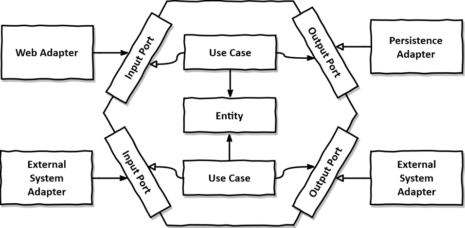

# 🎟️ Ticket API (`api-ticket`)

API RESTful Java (Spring Boot 3) responsável pela gestão de reservas e vendas de ingressos para eventos, desenvolvida com Arquitetura Hexagonal, persistência poliglota (Cassandra e Redis), mensageria (Kafka), segurança OAuth2 (Keycloak) e observabilidade completa (Prometheus, Loki, Jaeger e Grafana).

---

## 🏛️ Arquitetura e Modelagem

- **Arquitetura Hexagonal (Ports & Adapters)**
  

- **Modelo C4 (Containers)**
  

- **Diagrama de Sequência (Fluxo de Reserva)**
  

---

## 📋 Pré-requisitos Globais

Antes de construir o ambiente, certifique-se de ter instalado em sua máquina:

1. **Docker Engine & Docker Desktop** (com suporte a containers Linux).
2. **JDK 25** (ou JDK 17/21 LTS).
3. **Apache Maven 3.9+** (`mvn -v`).
4. **Git** (`git --version`).
5. **Terraform CLI (>= 1.5.0)** *(Necessário apenas para o Ambiente IaC / Kubernetes)*.
6. **Kind & Kubectl** *(Necessários apenas para o Ambiente IaC / Kubernetes)*.

---

## 🚀 Guia Passo a Passo: Construção do Ambiente

Você pode executar o projeto de **duas formas** dependendo da sua necessidade:

---

### 🟢 Opção A: Ambiente Rápido via Docker Compose (Recomendado para Devs)

Ideal para desenvolvimento diário da aplicação Java e testes de integração rápidos, sem necessidade de subir um cluster Kubernetes.

#### **Passo 1: Clonar o Repositório**
```bash
git clone https://github.com/rodsordi/api-ticket.git
cd api-ticket
```

#### **Passo 2: Compilar a Aplicação Java**
```bash
mvn clean package -DskipTests
```

#### **Passo 3: Subir a Stack no Docker Compose**
```bash
docker compose up -d --build
```

#### **Passo 4: Verificar a Saúde dos Serviços**
```bash
docker compose ps
```
Aguarde até que os serviços `cassandra`, `keycloak`, `redis` e `kafka` estejam no status `(healthy)`.

#### **Passo 5: Testar a Aplicação**
- **Swagger UI**: [http://localhost:8080/swagger-ui/index.html](http://localhost:8080/swagger-ui/index.html)
- **Actuator Health**: [http://localhost:8080/actuator/health](http://localhost:8080/actuator/health)
- **Grafana Dashboards**: [http://localhost:3000](http://localhost:3000)

#### **Parar o Ambiente Docker Compose:**
```bash
docker compose down
```

---

### 🟦 Opção B: Ambiente Completo via IaC (Terraform + Kubernetes / Kind)

Ideal para validar a esteira de CI/CD (GitHub Runner), análise estática de código (SonarQube), gestão do cluster (Rancher) e autoscaling (HPA).

#### **Passo 1: Definir as Variáveis de Ambiente Obrigatórias**
No terminal do seu sistema operacional (PowerShell ou Bash):

- **No Windows (PowerShell):**
  ```powershell
  $env:TF_VAR_github_pat="ghp_seu_token_github_aqui"
  ```
- **No Linux / macOS / WSL (Bash):**
  ```bash
  export TF_VAR_github_pat="ghp_seu_token_github_aqui"
  ```

#### **Passo 2: Executar o Script de Deploy Automatizado**
Acesse a pasta `iac/` e execute o script de provisionamento:

- **No Windows (PowerShell):**
  ```powershell
  cd iac
  .\scripts\deploy-iac.ps1
  ```
- **No Linux / macOS (Bash):**
  ```bash
  cd iac
  chmod +x scripts/deploy-iac.sh
  ./scripts/deploy-iac.sh
  ```

O script criará o cluster Kind (`ticket-cluster-local`), importará os registros e aplicará os módulos Terraform para subir Keycloak, Cassandra, Redis, Kafka, SonarQube, Runner e Grafana.

#### **Passo 3: Configurar o Contexto do `kubectl`**
```bash
# No Windows (PowerShell):
$env:KUBECONFIG = (kind get kubeconfig-path --name "ticket-cluster-local")

# No Linux/macOS:
export KUBECONFIG="$(kind get kubeconfig-path --name ticket-cluster-local)"

# Verificar Pods rodando:
kubectl get pods -n ticket
```

---

## 🌐 Tabela Geral de Endpoints & Serviços

| Serviço | Endpoint (Host Local) | Credenciais Padronizadas | Descrição |
| :--- | :--- | :--- | :--- |
| **`api-ticket`** | `http://localhost:8080` | N/A | API Principal de Ingressos |
| **Swagger UI** | `http://localhost:8080/swagger-ui/index.html` | N/A | Documentação interativa OpenAPI 3 |
| **Keycloak IAM** | `http://localhost:8081` | `admin` / `admin` | Servidor de Identidade / OAuth2 |
| **Grafana** | `http://localhost:3000` | Login Anônimo (Admin) | Painel com 11 Dashboards de Observabilidade |
| **SonarQube** | `http://localhost:30900` | `admin` / `Sonarqube@2026` | Análise de Qualidade de Código *(Apenas IaC/K8s)* |
| **Rancher UI** | `https://localhost:30443` | `admin` / `admin` | Gestão Visual do Cluster K8s *(Apenas IaC/K8s)* |
| **Prometheus** | `http://localhost:9090` | N/A | Servidor de Métricas |
| **Loki Logs** | `http://localhost:3100` | N/A | Agregador de Logs Centralizado |
| **Jaeger UI** | `http://localhost:16686` | N/A | Tracing Distribuído OpenTelemetry |
| **Cassandra** | `localhost:9042` | N/A | Banco de Dados NoSQL de Vendas |
| **Redis** | `localhost:6379` | N/A | Cache de Disponibilidade de Eventos |
| **Kafka Broker** | `localhost:9092` | N/A | Mensageria e Eventos de Reserva |

---

## 🔑 Autenticação e Testes da API (cURL)

As rotas da API são protegidas via OAuth2 / JWT emitidos pelo Keycloak (Realm: `ticket`).

### 1. Obter Token JWT de Acesso
```bash
curl --location 'http://localhost:8081/realms/ticket/protocol/openid-connect/token' \
--header 'Content-Type: application/x-www-form-urlencoded' \
--data-urlencode 'client_id=ticket-app' \
--data-urlencode 'username=admin' \
--data-urlencode 'password=admin' \
--data-urlencode 'grant_type=password'
```

### 2. Criar um Novo Evento (`POST /v1/events`)
```bash
curl --location 'http://localhost:8080/api/v1/events' \
--header 'Content-Type: application/json' \
--header 'Authorization: Bearer <TOKEN_JWT_OBTIDO>' \
--data-raw '{
    "name": "Rock in Rio 2026",
    "description": "Festival Internacional de Música",
    "price": 350.00,
    "totalTickets": 10000,
    "eventDate": "2026-09-15T20:00:00Z"
}'
```

### 3. Solicitar Reserva de Ingresso (`POST /v1/reservations`)
```bash
curl --location 'http://localhost:8080/api/v1/reservations' \
--header 'Content-Type: application/json' \
--header 'Authorization: Bearer <TOKEN_JWT_OBTIDO>' \
--data-raw '{
    "eventId": "778a2cf1-3190-4055-9f2f-8461a26ddd64",
    "ticketQuantity": 2
}'
```

### 4. Consultar Disponibilidade em Tempo Real (`GET /v1/events/{id}/availability`)
```bash
curl --location 'http://localhost:8080/api/v1/events/778a2cf1-3190-4055-9f2f-8461a26ddd64/availability' \
--header 'Authorization: Bearer <TOKEN_JWT_OBTIDO>'
```

---

## 📌 Documentação Adicional

- [Documentação Detalhada de Infraestrutura IaC (`iac/README.md`)](file:///c:/git/interviews/api-ticket/iac/README.md)
- [Wiki do Projeto no GitHub](https://github.com/rodsordi/api-ticket/wiki)

---

## ✒️ Autor

- **Rodrigo de Sordi** - [GitHub](https://github.com/rodsordi)
