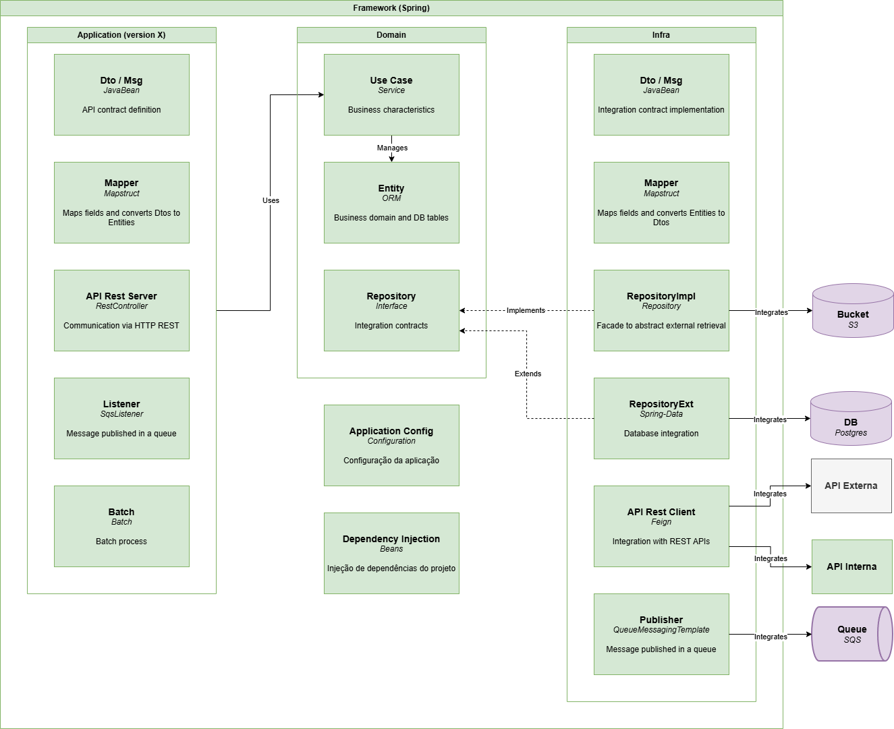
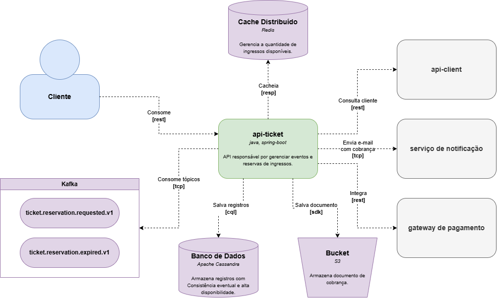
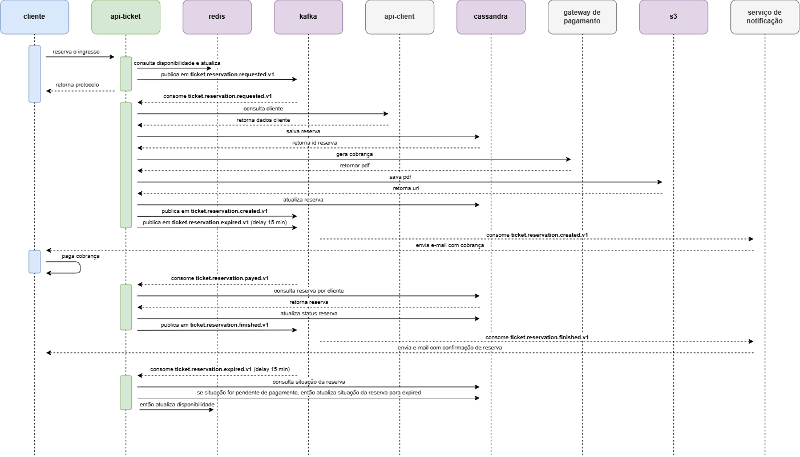

# Ticket API

API responsável pela gestão de reservas e vendas de ingressos para eventos. Projeto para a pós-graduação 15SOAT.

## 🗒️ Informações

- [Documentação na Wiki](https://github.com/rodsordi/15SOAT-TechChallenge/wiki)

## 🏛️ Arquitetura

**Arquitetura Hexagonal (Ports & Adapters)**



**Modelo C4 (Containers)**



**Diagrama de Sequência (Fluxo de Reserva)**



---

## 📋 Pré-requisitos

- [JDK 25](https://jdk.java.net/archive/)
- [Apache Maven 3.9.11](https://maven.apache.org/download.cgi)
- [Docker Engine & Docker Compose](https://docs.docker.com/engine/install/)
- [Terraform CLI (>= 1.5.0)](https://developer.hashicorp.com/terraform/downloads)
- [AWS CLI v2](https://aws.amazon.com/cli/)
- [kubectl & Helm 3.x](https://kubernetes.io/docs/tasks/tools/)

---

## ⚙️ Configuração do Ambiente Local

```sh
export JAVA_HOME=~/app/jdk-25.0.2
export PATH=$PATH:$JAVA_HOME/bin
```

### 📂 Clonando o Repositório

```sh
git clone https://github.com/rodsordi/15SOAT-TechChallenge.git
cd 15SOAT-TechChallenge
```

---

## 📦 Compilação e Execução Local

### 1. Compilando o Projeto com Maven

Para compilar e gerar o artefato JAR da aplicação:

```sh
mvn clean package -DskipTests
```

### 🐳 2. Executando com Docker Compose

Para compilar a imagem e subir toda a infraestrutura local (Aplicação, Cassandra, Redis, Kafka, Floci, Keycloak, etc.):

```sh
docker compose up --build -d
```

Para verificar o status dos containers em execução:

```sh
docker compose ps
```

Para visualizar os logs da aplicação:

```sh
docker compose logs -f app
```

Para parar todos os serviços:

```sh
docker compose down
```

---

## 🏗️ Infraestrutura como Código (IaC com Terraform)

A infraestrutura em nuvem na AWS está modularizada e dividida em dois repositórios Terraform dedicados:

1. **`15-soat-tech-challenge-iac-db`**: Provisiona o banco de dados AWS RDS PostgreSQL e a stack de observabilidade (Prometheus, Grafana, Loki, Jaeger).
2. **`15-soat-tech-challenge-iac-k8s`**: Provisiona o cluster AWS EKS, ECR, API Gateway, VPC Link e o Deployment Helm da aplicação Java.

### 🚀 Ordem de Provisionamento na AWS

> **Atenção**: O provisionamento do banco de dados (`iac-db`) deve obrigatoriamente preceder o cluster Kubernetes (`iac-k8s`).

---

### Passo 1: Provisionar Banco de Dados & Observabilidade (`iac-db`)

```sh
# 1. Clonar e acessar o repositório do banco de dados
git clone https://github.com/rodsordi/15-soat-tech-challenge-iac-db.git
cd 15-soat-tech-challenge-iac-db

# 2. Inicializar os módulos do Terraform
terraform init

# 3. Copiar e ajustar o arquivo de variáveis de exemplo
cp terraform.tfvars.example terraform.tfvars

# 4. Planejar as alterações
terraform plan -var-file="terraform.tfvars"

# 5. Aplicar o provisionamento
terraform apply -auto-approve
```

---

### Passo 2: Provisionar Cluster EKS, API Gateway & Aplicação (`iac-k8s`)

```sh
# 1. Clonar e acessar o repositório do Kubernetes / EKS
git clone https://github.com/rodsordi/15-soat-tech-challenge-iac-k8s.git
cd 15-soat-tech-challenge-iac-k8s

# 2. Inicializar o Terraform
terraform init

# 3. Configurar as variáveis com o endpoint do RDS e senha criados no Passo 1
cp terraform.tfvars.example terraform.tfvars

# 4. Planejar a infraestrutura
terraform plan -var-file="terraform.tfvars"

# 5. Aplicar a infraestrutura completa na AWS
terraform apply -auto-approve
```

---

### 🔑 Atualizando a Conexão do kubectl com o EKS

Após o provisionamento do cluster EKS via Terraform, atualize as credenciais do `kubectl`:

```sh
aws eks update-kubeconfig --name eks-garage-cluster --region us-east-1
```

Verifique a implantação dos pods da aplicação no namespace `garage`:

```sh
kubectl get pods -n garage
kubectl get svc -n garage
```

---

## 📄 Swagger / OpenAPI

| Ambiente | URL |
|----------|-----|
| Local    | [http://localhost:8080/api/swagger-ui/index.html](http://localhost:8080/api/swagger-ui/index.html) |

---

## 🌐 Exemplos de Chamadas cURL

### 1. Health Check

```sh
curl --location 'http://localhost:8080/api/actuator/health'
```

---

### 2. Criar Evento (`POST /v1/events`)

```sh
curl --location 'http://localhost:8080/api/v1/events' \
--header 'Content-Type: application/json' \
--header 'Authorization: Bearer <SEU_JWT_TOKEN>' \
--data-raw '{
    "name": "Rock in Rio 2026",
    "description": "Festival Internacional de Música",
    "price": 350.00,
    "availableQuantity": 10000,
    "eventDate": "2026-09-15",
    "totalQuantity": 10000
}'
```

---

### 3. Solicitar Reserva de Ingresso (`POST /v1/reservations`)

```sh
curl --location 'http://localhost:8080/api/v1/reservations' \
--header 'Content-Type: application/json' \
--header 'Authorization: Bearer <SEU_JWT_TOKEN>' \
--data-raw '{
    "eventId": "778a2cf1-3190-4055-9f2f-8461a26ddd64"
}'
```

---

### 4. Consultar Disponibilidade de Estoque do Evento (`GET /v1/events/{id}/availability`)

```sh
curl --location 'http://localhost:8080/api/v1/events/778a2cf1-3190-4055-9f2f-8461a26ddd64/availability' \
--header 'Authorization: Bearer <SEU_JWT_TOKEN>'
```

---

### 5. Buscar Detalhes da Reserva (`GET /v1/reservations/{id}`)

```sh
curl --location 'http://localhost:8080/api/v1/reservations/890cd168-ebec-414c-bcd0-000525079114' \
--header 'Authorization: Bearer <SEU_JWT_TOKEN>'
```

---

### 6. Pagar Reserva (`POST /v1/reservations/{id}/pay`)

```sh
curl --location 'http://localhost:8080/api/v1/reservations/890cd168-ebec-414c-bcd0-000525079114/pay' \
--header 'Authorization: Bearer <SEU_JWT_TOKEN>'
```

---

### 7. Cancelar Reserva (`POST /v1/reservations/{id}/cancel`)

```sh
curl --location 'http://localhost:8080/api/v1/reservations/890cd168-ebec-414c-bcd0-000525079114/cancel' \
--header 'Authorization: Bearer <SEU_JWT_TOKEN>'
```

---

## 📌 Versão

- Utiliza [SemVer](https://semver.org/) para controle de versão.

## ✒ Autores

- [Rodrigo de Sordi - RM372537](https://github.com/rodsordi)
